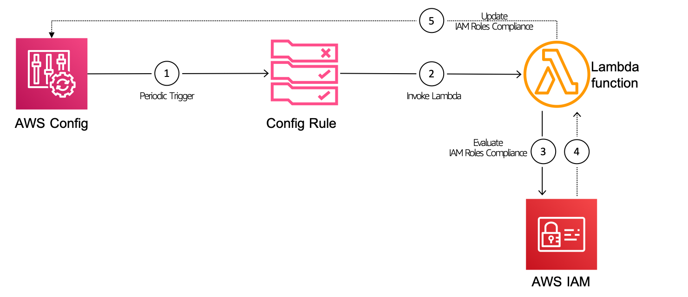

# Monitor unused IAM roles with AWS Config Custom Rules

 Identify IAM Roles that have not been used for `x` amount of time (for example, since last `30` days). We will use the `role last used` API  and continuously monitor role activity using AWS Config. You can extend this solution to push the `NON COMPLIANT` information to SNS and get the necessary teams involved in the clean up operation.

   

  Follow this article in **[Youtube](https://youtube.com/c/ValaxyTechnologies)**

1. ## Prerequisites

    This demo, instructions, scripts and cloudformation template is designed to be run in `us-east-1`. With few modifications you can try it out in other regions as well(_Not covered here_).

    - AWS CLI pre-configured - [Get help here](https://youtu.be/TPyyfmQte0U)

1. ## SetUp Dev Environment

    Make sure you have `AWS CLI` profile configured. You should have at [minimum these permissions](https://github.com/awslabs/aws-config-rdk/blob/master/policy/rdk-minimum-permissions.json) before executing below commands

    ```sh
    git clone https://github.com/miztiik/serverless-monitor-for-unused-iam-roles.git
    cd serverless-monitor-for-unused-iam-roles
    dir_name="mystique-infosec"
    custom_rule_name="monitor_unused_iam_roles"

    # If you dont have venv installed already
    # pip install virtualenv

    python3 -m venv ${dir_name}
    cd ${dir_name}
    source bin/activate
    pip3 install rdk

    # Configure AWS Profile
    rdk init

    # Lets create a LOCAL rule
    rdk create ${custom_rule_name} --runtime python3.7 --resource-types AWS::IAM::User
    ```

1. ## Copy the `Config Rule code`

    Copy the file under `lambda_src` to the directory `${custom_rule_name}` directory that was created now. The `custom_rule_name` and this file-name should be the SAME.

1. ## Deploy the custom rule

    ```sh
    rdk deploy ${custom_rule_name}
    ```

1. ## Test the rule

    1. Create a new role(or ideally any pre-existing role, which has not been used for sometime is good enough)
    1. Wait for `AWS Config` to evaluate the role and identify it as :x: `Noncompliant`

1. ## Next Steps: Do Try This

    - update the lambda `MAX_UNUSED_DAYS = 30` to different time period or make it a customizable variable
    - Integrate SNS notification
    - Quarantine old roles
    - Create exception list

1. ## Resource Cleanup

    1. Delete CloudWatch Lambda LogGroups
    1. Delete the stack[s] - If you want to destroy all the resources created by the stack, Execute the below command to delete the stack, or _you can delete the stack from console as well_

      ```sh
      rdk undeploy ${custom_rule_name}
      ```

### Buy me a coffee

Buy me a coffee ☕ through [Paypal](https://paypal.me/valaxy), _or_ You can reach out to get more details through [here](https://youtube.com/c/valaxytechnologies/about).

### References

1. [Getting Started with Custom Rules](https://docs.aws.amazon.com/config/latest/developerguide/evaluate-config_develop-rules_getting-started.html)
1. [AWS Config Rule Development Kit](https://aws.amazon.com/blogs/mt/introducing-the-aws-config-rule-development-kit-rdk/)
1. [AWS Config RDK - Getting Started - Blog](https://aws.amazon.com/blogs/mt/how-to-develop-custom-aws-config-rules-using-the-rule-development-kit/)
1. [AWS Config RDK - Getting Started - Git](https://github.com/awslabs/aws-config-rdk)
1. [Git Repo of Config Rules in Python-01](https://github.com/awslabs/aws-config-rules/tree/master/python)
1. [Git Repo of Config Rules in Python-02](https://github.com/dome9/cloud-bots/tree/master/bots)

### Metadata

**Level**: 200
